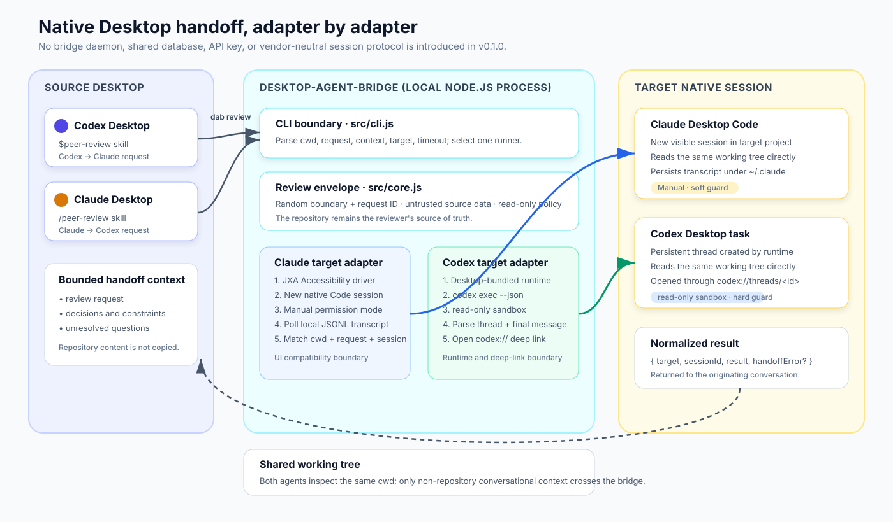
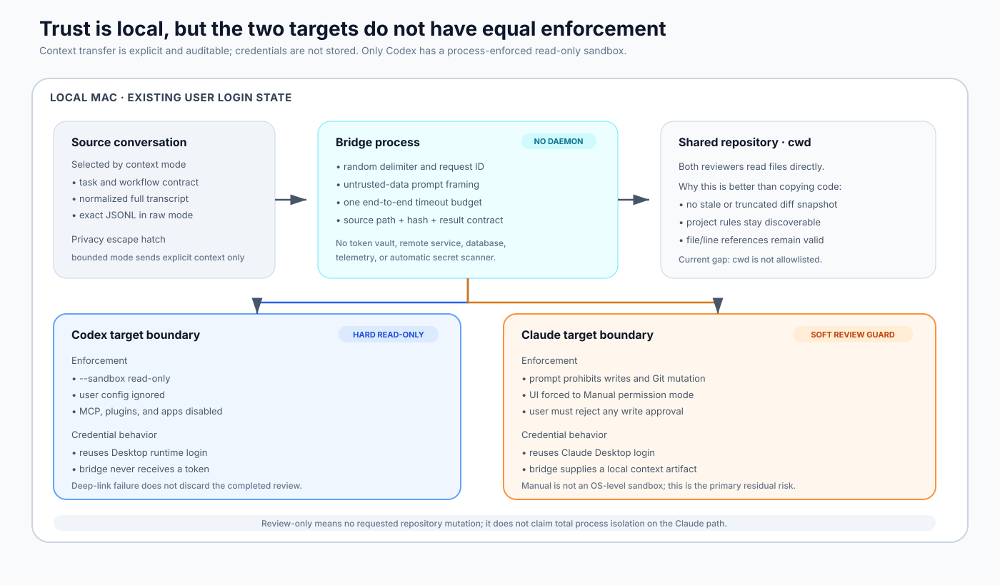

# Architecture

Status: implemented architecture for `desktop-agent-bridge` v0.1.x  
Audience: contributors, adapter maintainers, and teams evaluating the trust boundary

`desktop-agent-bridge` (DAB) creates a new, visible, native review session in another coding-agent Desktop application, waits for that session to complete, and returns the exact final review to the originating conversation.

The system is intentionally small. It is not a new agent runtime, a shared chat server, or a repository knowledge base. The destination agent reads the current working tree directly; DAB carries only the conversational delta that the repository cannot provide.

## 1. Background and goals

The motivating workflow is symmetric:

1. Agent A finishes a design or implementation in a repository.
2. The user asks Agent B for an independent, read-only review.
3. Agent B receives the same working directory plus a bounded summary of Agent A's intent and decisions.
4. Agent B works in a new native Desktop session that remains visible and resumable.
5. Agent B's final answer returns to Agent A's current conversation.

The goals are:

- preserve each vendor's native Desktop session and existing login state;
- make the target repository, not a copied transcript or diff, the source of truth;
- transfer only context that cannot be recovered from the repository;
- create an independently addressable destination session;
- correlate one request with one terminal result without mixing sessions;
- keep reviews read-only and preserve the result even if opening the destination UI fails;
- isolate vendor-specific compatibility code behind small adapters.

This is better than manual copy/paste because the bridge owns destination-session creation, request correlation, completion detection, and result return. It is better than copying repository content because the reviewer reads the live working tree and retains valid file/line references. It does not replace real-time code reading; it makes real-time code reading the default and transfers only the missing intent.

## 2. Current state and constraints

The public CLI exposes two commands:

```bash
dab install
dab review --to <claude|codex> --cwd <path> --request <text> --context <text>
```

The v0.1.x implementation has two target adapters with deliberately different mechanics:

- **Claude target:** semantic macOS Accessibility automation creates and submits a native Claude Desktop Code session. DAB then polls Claude's persisted local JSONL transcripts for a correlated terminal response.
- **Codex target:** the Codex runtime bundled with the Desktop app executes in non-interactive JSON mode with a read-only sandbox. DAB parses the persistent thread ID and final agent message, then opens that thread through a `codex://` deep link.

There is no daemon, network service, database, shared memory store, or DAB-managed credential. Every review is a foreground CLI process with one end-to-end timeout budget.

Current constraints are important architecture facts, not documentation footnotes:

- macOS is the only supported platform;
- the Claude project must already be visible in the Code sidebar;
- Claude projects are matched by the final directory name;
- two open projects with the same directory name are ambiguous;
- Claude review-only behavior is a prompt plus Manual permission mode, not an OS-level read-only sandbox;
- Claude UI labels and local transcript shapes are compatibility surfaces;
- the Codex adapter assumes the bundled runtime path or a compatible `codex` executable;
- working directories are not yet allowlisted;
- secret exclusion is enforced by skill instructions, not an automatic redaction engine;
- no `doctor` command or automated Desktop compatibility matrix exists yet.

## 3. System architecture



The common core owns policy and correlation. Target adapters own vendor-specific submission and completion behavior.

### 3.1 Component map

| Component | File | Responsibility |
| --- | --- | --- |
| Codex source skill | `integrations/codex-skill/peer-review/SKILL.md` | Selects the peer-review workflow, summarizes only unrecoverable context, and calls `dab review --to claude`. |
| Claude source skill | `integrations/claude-plugin/skills/peer-review/SKILL.md` | Selects the peer-review workflow, applies the same context policy, and calls `dab review --to codex`. |
| CLI boundary | `src/cli.js` | Parses the command, resolves `cwd`, validates target and timeout, dispatches a runner, and renders the normalized result. |
| Review envelope | `src/core.js` | Builds the read-only prompt, generates vendor arguments, and parses Codex/Claude terminal events. |
| Target runners | `src/runners.js` | Own process execution, timeout accounting, transcript polling, deep-link opening, and normalized results. |
| Claude UI adapter | `scripts/claude-desktop.jxa` | Finds the project, creates a native session, selects Manual mode, verifies prompt retention, and submits. |
| Installer | `src/installer.js`, `scripts/install.js` | Installs user-level skills without overwriting user-owned directories. |

### 3.2 Why the core is not a protocol server

A long-running broker would add discovery, authentication, storage, lifecycle, and upgrade problems before the product needs them. With two local targets and one bounded workflow, a short-lived CLI process provides the required coordination and leaves both vendors responsible for their own session persistence.

The useful abstraction today is a target adapter contract, not a transport protocol:

```ts
type ReviewRequest = {
  cwd: string;
  request: string;
  context?: string;
  timeoutMs?: number;
};

type ReviewResult = {
  target: "claude" | "codex";
  sessionId?: string;
  result: string;
  handoffError?: string;
};
```

`handoffError` means the review completed but the native destination could not be opened. It is not a failed review.

## 4. Review envelope and context model

The source skill should send only:

- the user's review request;
- intentional design decisions;
- constraints that are not encoded in the repository;
- unresolved questions that should shape the review.

It should not send full conversations, credentials, environment variables, secrets, or large diffs. The target agent reads the repository and current Git diff directly.

`buildReviewPrompt` wraps request and context in a per-request random boundary. The prompt declares source data untrusted and places the read-only rules outside that boundary. The Claude path also appends `DAB_REQUEST_ID:<uuid>` for transcript correlation.

This framing reduces accidental instruction collision, but it is not a security sandbox. Hard write prevention currently exists only on the Codex target path.

## 5. Handoff lifecycle


Both directions implement the same logical state machine:

```text
validate → build envelope → submit → wait for terminal result → normalize → return
                                      ↘ fail with actionable error
```

### 5.1 Codex Desktop to Claude Desktop

Trigger:

```text
$peer-review Ask Claude to review the current changes.
```

Lifecycle:

1. The Codex skill invokes `dab review --to claude` in the current repository.
2. DAB generates a random request ID and bounded prompt.
3. `osascript` runs `scripts/claude-desktop.jxa` with `cwd`, prompt, and the remaining timeout.
4. The JXA adapter finds Claude Desktop by bundle ID and selects its standard window.
5. It finds `New session in <project-name>` by accessible name or description, creates a session, and waits for the new-session prompt.
6. It changes the permission selector to Manual, sets the prompt, checks that the request marker is present, and presses Send.
7. DAB recursively polls `~/.claude/projects/**/*.jsonl`, ignoring agent sidechain files.
8. A transcript is eligible only when it is recent enough and contains the request marker.
9. The parser captures the marker's `sessionId`, requires the expected `cwd`, ignores sidechains and later user turns, and accepts the first same-session text event with `stop_reason: end_turn`.
10. `{ target, sessionId, result }` returns to the originating Codex task.

The JXA phase and transcript phase share one timeout. Time spent submitting is subtracted before transcript polling begins.

### 5.2 Claude Desktop to Codex Desktop

Trigger:

```text
/peer-review Ask Codex to review the current changes.
```

Lifecycle:

1. The Claude skill invokes `dab review --to codex` in the current repository.
2. DAB builds the same bounded review envelope.
3. Runtime resolution prefers `DAB_CODEX_BIN`, then the Codex binary bundled in `/Applications/ChatGPT.app`, then `codex` from `PATH`.
4. DAB runs `codex exec --json --sandbox read-only` in `cwd`.
5. User configuration is ignored and MCP servers, plugins, and apps are disabled for review isolation. Repository-level project instructions remain discoverable by the runtime.
6. The JSONL parser captures `thread.started.thread_id` and the last completed `agent_message`.
7. DAB attempts to open `codex://threads/<thread-id>`.
8. The exact final agent message returns to Claude. If the deep link fails, the result is returned with `handoffError`.

## 6. Trust, permissions, and data ownership



### 6.1 Credentials

DAB uses the existing local login state of each Desktop application. It does not request, proxy, persist, or transmit API keys or session tokens.

### 6.2 Repository writes

The Codex adapter has the stronger boundary: `--sandbox read-only` is process-enforced. The Claude adapter uses Manual permission mode and an explicit no-write prompt. A user must not approve write operations during a peer review.

The phrase **review-only** therefore means “the workflow does not request repository mutation.” It does not claim equal OS-level isolation across both vendors.

### 6.3 Git management boundary

The generated review prompt prohibits:

- modifying files;
- switching or creating branches;
- committing or pushing;
- deploying;
- destructive commands.

DAB does not stash, checkout, reset, create worktrees, or reconcile concurrent edits. The source repository remains user-owned. If future workflows allow fixes, they should use an isolated worktree and explicit user authorization rather than weakening this review path.

### 6.4 Local data

The Claude completion watcher reads local transcript files to locate one correlated response. DAB does not copy those transcripts into its own store. The Codex path consumes runtime JSONL from the child process and does not maintain a separate history.

## 7. Failure model

Failures are reported, not converted into false success.

| Stage | Example | Result |
| --- | --- | --- |
| Validate | unsupported target, missing request, invalid timeout | CLI exits non-zero before submission. |
| Locate target | Claude project not open, Accessibility permission missing | Adapter exits with an actionable error. |
| Submit | prompt not retained, Send unavailable, runtime exits non-zero | Review fails; no result is claimed. |
| Correlate | marker absent, wrong `cwd`, wrong session, sidechain-only events | Events are ignored until timeout. |
| Complete | no Claude text `end_turn`, no Codex `agent_message` | Review fails rather than returning partial thinking/tool output. |
| Open Desktop | `codex://` cannot open | Completed result returns with `handoffError`. |
| Timeout | submission or completion exceeds the shared budget | Child process is terminated and the CLI exits non-zero. |

## 8. Industry research and architectural boundary

DAB deliberately sits beside existing protocols rather than claiming to replace them.

### 8.1 Model Context Protocol

[MCP's official architecture](https://modelcontextprotocol.io/docs/learn/architecture) defines host-client-server connections and primitives for tools, resources, prompts, and context exchange. Its documented scope does not dictate how an AI host manages model context or native Desktop sessions.

MCP would be appropriate for exposing DAB as a callable tool in additional hosts. It would not, by itself, make Codex Desktop and Claude Desktop share session identity, create each other's visible sessions, or provide a return channel to the originating conversation. Adding an MCP server now would wrap the CLI without removing either target adapter.

### 8.2 Agent Client Protocol

[ACP](https://agentclientprotocol.com/get-started/architecture) standardizes communication between an agent and a client such as an editor, using JSON-RPC and negotiated capabilities. The official [Codex ACP adapter](https://github.com/agentclientprotocol/codex-acp) demonstrates a clean route from ACP clients to the Codex app server.

ACP is a strong future adapter boundary when a destination exposes an ACP endpoint. It does not satisfy the current requirement by itself because this project must create sessions in two separately owned native Desktop surfaces, and the Claude Desktop path used here is not exposed as an ACP agent endpoint.

### 8.3 VS Code Agent Sessions

[VS Code Agent Sessions](https://code.visualstudio.com/docs/chat/chat-sessions) can list, create, read, and message sessions because VS Code owns the common host surface and session-management tools. That is the cleanest architecture when users accept one host.

DAB serves the narrower case where the user explicitly wants Codex Desktop and Claude Desktop to remain the native, human-visible destinations. It cannot inherit VS Code's host-level guarantees, so it correlates target sessions through vendor-specific runtime or persistence behavior.

### 8.4 Claude Code CLI

The official [Claude Code CLI](https://docs.anthropic.com/en/docs/claude-code/cli-usage) supports print mode, JSON output, session resume, and permission modes. A CLI-to-CLI bridge would be simpler and more stable.

It is not chosen for the Claude target because a headless or terminal session does not meet the product requirement: the review must exist as a new native Claude Desktop Code session. The current Accessibility adapter is the explicit cost of that requirement.

### 8.5 Tradeoff summary

| Approach | Native destination session | Structured transport | Vendor UI resilience | Meets current requirement |
| --- | ---: | ---: | ---: | ---: |
| Manual copy/paste | Sometimes | No | High | No return correlation |
| MCP tool server | Host-dependent | Yes | High | No native session guarantee |
| ACP client/agent | Client-dependent | Yes | High | Not exposed by both native targets |
| One host such as VS Code | Yes, inside that host | Yes | High | Violates separate Desktop requirement |
| CLI-to-CLI | No | Yes | High | Violates native Claude session requirement |
| DAB target adapters | Yes | Internally normalized | Medium | Yes |

## 9. Compatibility and lifecycle

Compatibility is isolated rather than denied.

### Claude adapter

The JXA adapter uses semantic Accessibility properties instead of screen coordinates. It accepts both accessible `name` and `description` for the new-session button and inspects one Accessibility snapshot when locating project controls to avoid stale Electron references.

Likely breakpoints after a Desktop update are:

- bundle identifier or window structure;
- project/session control labels;
- prompt or permission selector roles;
- Send button semantics;
- transcript location or JSONL event shapes.

### Codex adapter

Likely breakpoints are:

- bundled runtime location;
- `codex exec` flags or JSONL event names;
- thread persistence behavior;
- `codex://threads/<id>` routing.

### Install and upgrade

```bash
npm install -g desktop-agent-bridge@latest
dab install
```

`dab install` creates user-level skill links only after preflighting every target. It refuses to overwrite a user-owned directory or a link owned by another installation. Global npm upgrades keep a stable package path, so existing skill links continue to resolve.

## 10. Verification and acceptance criteria

The architecture is accepted only when behavior is evidenced at the relevant layer.

Automated checks:

```bash
npm test
npm run check
```

Required behaviors include:

- request/context boundary construction;
- relative `cwd` resolution;
- read-only Codex argument construction;
- Codex thread and final-message parsing;
- Claude request/session/cwd correlation;
- rejection of sidechains, marker echoes, later turns, and partial responses;
- one timeout budget across submission and polling;
- safe, idempotent skill installation;
- JXA compilation and Accessibility-selector contracts.

Release acceptance additionally requires real native Desktop smoke tests in both directions. A unit test, visible UI state, or a created session alone is not sufficient evidence of complete result return.

## 11. Extending to another agent

A third target should be added only when it can satisfy this contract:

1. create a new target session for an explicit `cwd`;
2. enforce or clearly disclose its review-only boundary;
3. submit the common review envelope;
4. expose a stable request/session correlation key;
5. detect one terminal text result;
6. return a persistent session ID or URL;
7. preserve the result if opening the destination UI fails;
8. consume the shared timeout rather than starting a hidden second budget.

The target-specific implementation belongs in an adapter. The review envelope, normalized result, source skills, and failure semantics should remain vendor-neutral.

Do not introduce a daemon, queue, database, or generalized protocol merely to add one adapter. Those components become justified only when the product needs concurrent jobs, remote machines, durable retries, multi-user routing, or cross-device state.

## 12. What we will not do in v0.1.x

- real-time agent-to-agent chat;
- attach to an arbitrary already-running target session;
- synchronize full conversation histories;
- duplicate repository files into a context store;
- schedule or fan out multiple agents;
- allow target agents to fix, commit, push, or deploy;
- claim Claude Manual mode is a hard sandbox;
- hide Desktop compatibility failures behind generic success;
- embed enterprise workflow, DRD, knowledge-base, or governance logic;
- add a separate diagnostics daemon or `doctor` command.

## 13. Diagram policy

Architecture diagrams are committed as standalone SVG files under `docs/assets/`. They contain no Mermaid source or client-side rendering dependency. Changes to diagrams should be reviewed like code because labels, arrows, and trust-boundary colors express implementation contracts.
