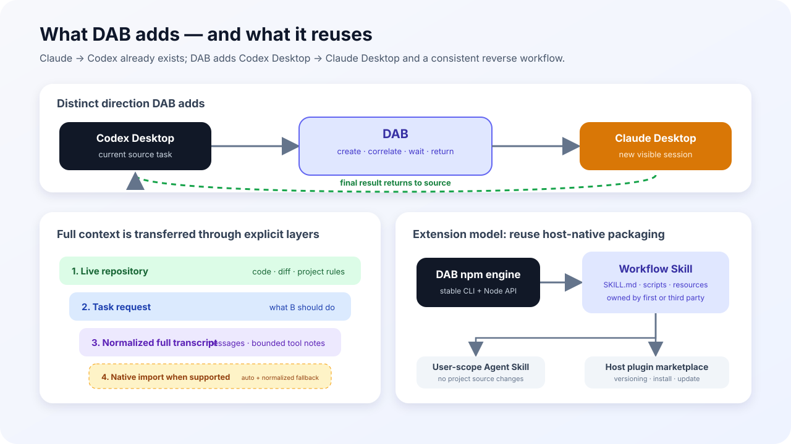

# 为什么要做 Desktop Agent Bridge

状态：截至 2026-08-13 的市场调研与产品边界记录
目的：解释为什么现有产品没有完整满足本项目的目标，以及 DAB 应如何处理 Context 和可插拔 Skill

本文只把官方文档和公开源码能证明的内容写成“调研事实”。由这些事实推导出的产品选择，会明确标记为“DAB 结论”，避免把我们的设计建议说成行业现状。

## 1. 我们真正要解决的问题

目标不是泛化的“多个 Agent 可以互相发消息”，而是同时满足下面五点：

1. 源头是用户正在使用的原生 Codex Desktop 或原生 Claude Desktop 会话；
2. 目标 Agent 在同一个本地项目下创建一个新的、用户可见的原生 Desktop 会话；
3. 目标 Agent 能读取当前工作树，并获得完成任务所需的源会话 Context；
4. 目标 Agent 独立完成 code review 等动作；
5. 目标 Agent 的最终结论自动返回源会话，用户不需要在窗口之间复制粘贴。

这五点缺一不可。CLI 之间能通信、在 VS Code 里统一托管多个 Agent、或者把一段消息送到另一个终端，都只能解决其中一部分。



## 2. 市面上的产品实际解决了什么

### 2.1 对照结论

| 产品 | 实际运行表面 | Context 的实际处理 | 能否满足原生 Desktop 双向闭环 |
| --- | --- | --- | --- |
| OpenAI `codex-plugin-cc` | Claude Code → 本地 Codex runtime / Codex 持久线程 | review 读取 Git 状态；rescue 转发任务文本；transfer 以 Claude transcript JSONL 为输入导入 Codex 线程 | 不能。它非常接近 Claude Code → Codex，但源头不是 Claude Desktop，也没有 Codex Desktop → Claude Desktop 的对称路径 |
| `agent-bridge` | Claude Code ↔ Codex CLI/TUI 持久 peer | daemon 维护连接；Claude 侧经 MCP、Codex 侧经 app-server 交换消息并保持 peer 关系 | 不能。它已经解决真正双向的 Agent bridge，但运行表面是 CLI/TUI，不是两个原生 Desktop 应用 |
| `hcom` | 被 `hcom` 启动或接管的多个 CLI Agent | 消息经 hooks 和本地 SQLite 投递；Agent 可查询 inbox、结构化 transcript、文件编辑和事件日志 | 不能。解决的是终端 Agent 通信与编排，不创建两个厂商的原生 Desktop 会话 |
| `agentchattr` | CLI wrapper + 本地聊天服务 + MCP | 被 @ 的 Agent 读取频道近期消息；job 会携带标题、状态和该 job 的会话历史 | 不能。Context 来自共享聊天室或 job，不是源 Desktop 的私有会话上下文 |
| `agent-talk` | 独立 CLI Agent + `retalk` 消息通道 | 传递显式消息；项目明确不提供共享任务列表、lead 或自动汇总 | 不能。它提供通信原语，不负责原生 Desktop session 创建和 review 结果闭环 |
| VS Code Agent Sessions | VS Code 统一宿主内的 Copilot、Claude、Codex 等 session | 同一 session fork 可复制完整历史；跨 session 工具读取的是 recent conversation context | 不能。能力成立的前提是所有 session 都由 VS Code 这个共同宿主管理，而不是两个独立 Desktop 应用 |

### 2.2 关键证据

#### `codex-plugin-cc`

这是最接近 DAB 的对照产品，也最能说明“Context”不能被笼统理解成一种东西：

- [`/codex:review`](https://github.com/openai/codex-plugin-cc/blob/main/plugins/codex/commands/review.md) 的输入是本地 Git 状态；它执行 Codex review，不会把 Claude 对话历史自动作为 review 输入。
- [`codex-rescue` agent](https://github.com/openai/codex-plugin-cc/blob/main/plugins/codex/agents/codex-rescue.md) 被要求保留用户任务文本，仅做必要的 prompt tightening，然后把任务交给 Codex runtime。这是“显式任务文本 + 共享代码目录”。
- [`/codex:transfer`](https://github.com/openai/codex-plugin-cc/blob/main/plugins/codex/commands/transfer.md) 是另一类能力：SessionStart hook 提供当前 Claude transcript 路径，Codex external-agent importer 转换该 JSONL，并创建可在 Codex App 或 TUI 中继续的持久线程。这里不是简单摘要，而是“会话记录导入”，但会遵循 importer 的转换规则。
- [README](https://github.com/openai/codex-plugin-cc#codex-plugin-for-claude-code) 明确把使用面定义为 Claude Code 内调用 Codex。它证明单向 handoff 和 transcript import 已经存在，但没有证明原生 Claude Desktop ↔ 原生 Codex Desktop 的双向闭环已经存在。

因此，我们不能再把市场缺口描述成“没有任何 Claude → Codex handoff”。准确说法是：**已有 Claude Code → Codex 的委派和会话导入；在本次调研的一手资料中，还没有发现同时满足五项条件的原生 Desktop 双向产品。**

#### `hcom`

[`hcom` README](https://github.com/aannoo/hcom#how-it-works) 说明消息通过 hooks 写入本地 SQLite，再注入另一个 Agent；每个 Agent 暴露可查询的 inbox、terminal screen、结构化 transcript 和事件日志。README 也宣称支持 handoff 的 bundled context。

但公开说明没有证明“每次 handoff 都自动复制发送方完整模型上下文”。能确认的是：它保存并暴露消息、transcript 和事件，让 Agent 在需要时查询；运行对象仍然是 CLI/terminal Agent。

#### `agent-bridge`

[`agent-bridge` README](https://github.com/raysonmeng/agent-bridge#architecture) 描述了一个真正双向、持久的 Claude Code ↔ Codex peer：`abg claude` 和 `abg codex` 启动终端 Agent，daemon 负责路由，Claude 通过 MCP、Codex 通过 app-server 交换消息。它证明“双向 bridge”本身不是 DAB 独有价值；DAB 要补的是不同边界——用户正在使用的两个原生 Desktop session、可见目标 session、源 transcript 与结果返回。

#### `agentchattr`

[`agentchattr` README](https://github.com/bcurts/agentchattr#how-it-works) 给出的流程是：wrapper 向目标终端注入指令，让目标 Agent 通过 MCP 读取频道近期消息。普通频道共享聊天记录；job 模式会给 Agent 标题、状态和完整 job 会话历史。它没有复制某个 Agent 的私有会话，而是建立一块新的共享协作 Context。

#### `agent-talk`

[`agent-talk` README](https://github.com/xhluca/agent-talk#how-is-agent-talk-different-from-claude-codes-agent-teams) 明确将自己定义为 messaging primitive：独立 Agent 互发消息，但不提供 lead、共享任务列表或自动 synthesis。也就是说，发送方必须把希望对方知道的内容写入消息；工具本身不把 Agent A 的整个思考历史变成 Agent B 的上下文。

#### VS Code Agent Sessions

[VS Code 官方文档](https://code.visualstudio.com/docs/agents/run/sessions/manage-sessions) 区分了两件事：同一对话 `/fork` 会复制完整 conversation history；Agent Host 的 session-management tools 则可以创建其他 session、读取其他 session 的 recent conversation context、再发送消息。它之所以稳定，是因为 VS Code 同时拥有 session 数据和目标宿主。

这条路径非常值得借鉴，但它不能直接移植到 DAB：Codex Desktop 和 Claude Desktop 没有一个共同的公开 Host API。

## 3. Context 调研结论

### 3.1 调研事实：市场上至少存在四种 Context 模式

1. **共享工作树**：目标 Agent 直接读取代码、Git diff 和项目规则。`codex-plugin-cc review` 属于这一类。
2. **显式任务或消息**：发送方只传任务文本，目标 Agent 再读仓库。`codex-plugin-cc rescue`、`agent-talk` 属于这一类。
3. **共享消息历史**：双方读取同一个频道、job 或消息数据库。`agentchattr`、`hcom` 属于这一类。
4. **宿主拥有的会话历史**：宿主复制、读取或导入 transcript。VS Code fork 和 `codex-plugin-cc transfer` 属于这一类。

没有证据支持“成熟产品都默认把 Agent A 的完整上下文原样塞给 Agent B”这个结论。相反，Context 的范围取决于任务类型和宿主是否拥有可读取、可导入的会话记录。

### 3.2 DAB 结论：完整 transcript 应是一等能力，但不能等同于原生历史

源码核查修正了最初只传 bounded context 的产品选择。把本地 JSONL 交给目标 Agent 在技术上可行，而且 `codex-plugin-cc transfer` 已经证明 Claude → Codex 的原生导入路径成立。DAB v0.2 因此把两件事同时保留：

- 代码、diff、测试和项目规则仍以当前工作树为准；
- bundled `peer-review` Skill 默认使用 `auto`，让 B 可以读取 A 的完整规范化 transcript；
- Claude → Codex 优先调用 Codex external-agent importer，转换为真正的 Codex 原生历史；
- Codex → Claude 因为没有公开的异构历史 importer，创建新 Claude Desktop session，并提供规范化 transcript 文件；
- 原始 JSONL 始终保留为可审计源，不把全部事件文本直接拼进一次模型 prompt；
- B 的最终结果仍必须关联到本次请求并回到 A。

这里的“完整”是“目标 Agent 可访问完整会话记录”，不是“JSONL 每个字节同时进入模型上下文窗口”。规范化会排除 source-host developer/system 控制、隐藏 reasoning、meta 和 sidechain；Claude tool call/result 会转成有限长度的历史说明。`raw` 模式才直接暴露精确 JSONL 路径和哈希。

公开 Context 模式现在是：

- `bounded`：只传显式 `--context`；
- `auto`：有原生 importer 就导入，否则生成完整规范化 transcript；
- `full`：强制使用完整规范化 transcript；
- `raw`：把精确 JSONL 作为历史证据交给目标。

因此两个方向已经在功能上实现“B 能获得 A 的完整会话”，但只有 Claude → Codex 被验证为原生历史导入。Codex → Claude 不应被描述成 UI 历史迁移。

## 4. 可插拔 Skill / Package 调研结论

### 4.1 调研事实：别人没有统一用 npm 作为 Skill 格式

市场上更常见的是把三层拆开：

1. **执行引擎**：npm、Python、Rust binary 或 MCP server，负责确定性能力；
2. **Skill**：`skills/<name>/SKILL.md` 加可选脚本和资源，告诉 Agent 何时以及如何调用引擎；
3. **宿主分发**：Claude/Codex plugin marketplace，或把 Skill 安装到宿主识别的 user/project 目录。

证据包括：

- [Claude Code 官方 Plugin 文档](https://code.claude.com/docs/en/plugins) 将 standalone `.claude/` 配置定位为个人或项目定制，将含 `.claude-plugin/plugin.json` 的 Plugin 定位为可复用、可版本化、可通过 marketplace 分发的包。一个 Plugin 可以包含 skills、agents、hooks、MCP server 和 `bin/`。
- [`codex-plugin-cc` 的源码布局](https://github.com/openai/codex-plugin-cc/tree/main/plugins/codex) 正是这种组合：manifest、commands、agents、skills、hooks、scripts 放在同一个 Claude Plugin 中，而真正的 Codex runtime 仍由独立的 `@openai/codex` 包提供。
- [`agent-talk`](https://github.com/xhluca/agent-talk#quickstart) 把同一套顶层 `skills/` 同时交给多个宿主，并分别提供 `.claude-plugin`、`.codex-plugin` manifest；对于直接支持 Agent Skills 目录的宿主，则安装或链接同一套 `SKILL.md`。
- [GitHub CLI `gh skill install`](https://cli.github.com/manual/gh_skill_install) 已支持从 GitHub 仓库发现 `skills/*/SKILL.md`，按 Codex、Claude Code 等宿主安装到 project 或 user scope，并记录来源、版本和更新信息。该能力目前仍标记为 preview。

`hcom` 和 `agentchattr` 提供的是通信程序、hooks/wrapper 或 MCP 工具；本次查看到的公开文档没有显示它们已经提供一个“第三方可以发布任意 workflow Skill”的统一 registry。因此不能拿它们证明 `dab skill add` 是行业通行做法。

### 4.2 DAB 结论：引擎与 Workflow Skill 解耦，但不自建 Skill 商店

DAB 应保持下面的边界：

```text
desktop-agent-bridge npm package
  └─ 稳定 CLI / JSON contract
       ├─ first-party peer-review Skill
       ├─ third-party security-review Skill
       ├─ third-party architecture-challenge Skill
       └─ third-party test-plan Skill
```

- `desktop-agent-bridge` npm 包负责 Desktop session 创建、权限边界、请求关联、等待完成和结果返回；
- Skill 负责 workflow 语义：何时触发、从当前会话提取什么 Context、给目标 Agent 什么任务、如何解释结果；
- 第三方 Skill 可以放在自己的 GitHub 仓库或宿主 Plugin 中，只依赖已安装的 `dab` CLI，不需要落到业务项目源码；
- 用户通过 Claude/Codex 原生 Plugin 机制或 user-scope Agent Skill 安装它；DAB 不复制一套 marketplace、版本解析和更新系统；
- npm 继续作为 DAB 执行引擎的分发方式，不强迫每个 Skill 也发布成 npm 包。

因此，之前设想的 `dab skill add` 不是当前结论。只有当宿主原生安装机制无法表达 DAB 所需的依赖、权限或生命周期时，才有理由增加 DAB 自己的插件管理层。目前证据不支持先做这一层。

### 4.3 第三方 Skill 与 DAB 的最小契约

现阶段可插拔能力通过稳定 CLI 或 Node API完成，不需要 DAB 自建 Skill registry：

```bash
dab handoff \
  --to <claude|codex> \
  --cwd <absolute-project-path> \
  --request <target-task> \
  --workflow <workflow-name> \
  --instructions <result-contract> \
  --context-mode auto \
  --json
```

Node package也可以 `import { handoff } from "desktop-agent-bridge"`。仓库中的 `examples/security-review-skill` 给出了同时适配 Claude Plugin 和 Codex/Agent Skills 目录的最小结构。

Skill 不应该直接操作 Claude/Codex 的 UI、transcript 或 deep link；这些不稳定细节由 DAB adapter 统一承担。DAB 也不应该理解每一种 review 方法论；这部分属于 Skill。

这使第三方 Skill 可以独立升级，同时避免把 Skill 文件写入被 review 的业务仓库。项目级 Skill 仍可作为用户主动选择的安装方式，但不是默认要求。

## 5. 最终产品判断

### 为什么现在仍然要做 DAB

在本次核对的代表性产品与官方文档中：

- CLI Agent 的消息、委派和 transcript import 已经有人解决；
- 单一宿主内的多 session 管理已经有人解决；
- Agent Skills 的打包和跨宿主安装正在趋于标准化；
- **没有发现一个产品同时完成原生 Codex Desktop ↔ 原生 Claude Desktop、新建可见 session、同项目 review、必要 Context 传递和结果自动返回。**

DAB 的价值不是重新实现聊天、MCP、Skill marketplace 或知识库，而是补上最后这个原生 Desktop session bridge。

### 我们不做什么

- 不把 DAB 做成通用多 Agent 聊天室或调度平台；
- 不声称完整复制了模型内部上下文；
- 不用 RAG、向量库或“自学习”包装一次会话交接；
- 不自建 Skill marketplace，除非未来出现原生机制无法解决的明确证据；
- 不把第三方 Skill 强制写进用户的业务项目；
- 不为了传 Context 而替代目标 Agent 对当前代码和 Git 状态的实时读取。

## 6. 验收标准

这份产品边界成立，需要持续满足：

1. 两个方向都创建新的、用户可见且可恢复的原生 Desktop session；
2. 目标 session 与当前 `cwd` 和单次请求可靠关联；
3. bundled review 默认以 `auto` 获得完整会话，同时实时读取工作树；
4. 最终结果自动回到源会话，不需要人工复制；
5. 第三方 workflow 能只通过稳定 CLI/JSON contract 使用 DAB；
6. 第三方 Skill 可安装在 user scope 或宿主 Plugin cache，不要求修改业务仓库；
7. 任何 full transcript 路径都必须显式、可审计，并清楚说明转换与隐私边界。
